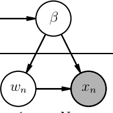
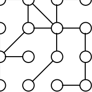
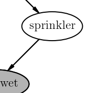
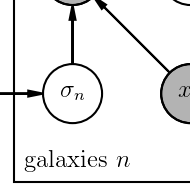
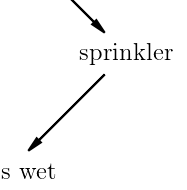
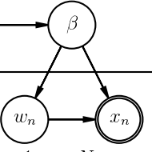

Daft
====

Examples
--------

Summary
-------

**Daft** is a Python package that uses `matplotlib <http://matplotlib.org/>`_
to render pixel-perfect *probabilistic graphical models* for publication
in a journal or on the internet. With a short Python script and an intuitive
model-building syntax you can design directed and undirected graphs and save
them in any formats that matplotlib supports.

Installation
------------

Installing the most recent stable version of Daft should be pretty easy
if you use `pip <http://www.pip-installer.org>`_:

::

    pip install daft

Otherwise, you can download the source (`tar
<https://github.com/dfm/daft/tarball/master>`_, `zip
<https://github.com/dfm/daft/zipball/master>`_) and run:

::

    python setup.py install

in the root directory.

Daft only depends on `matplotlib <http://matplotlib.org/>`_ and
`numpy <http://numpy.scipy.org>`_. These are standard components of the
scientific Python stack but if you don't already have them installed ``pip``
will try to install them for you but sometimes it's easier to do that part
yourself.

Contributing
------------

For the hackers in the house, development happens on `Github
<https://github.com/dfm/daft>`_ and we welcome pull requests. In particular,
we'd love to see examples of how you're using Daft in your work.

License
-------

*Copyright 2012 Daniel Foreman-Mackey, David W. Hogg and contributors.*

**Daft** is free software made available under the *MIT License*. For details
see `the LICENSE file <https://raw.github.com/dfm/daft/master/LICENSE.rst>`_.

If you use Daft in academic projects, acknowledgements are greatly
appreciated.

API
---

.. toctree::
   :maxdepth: 2

   api
